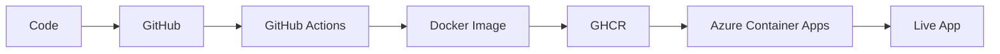

# DevOps Health API

A small but complete DevOps portfolio project built to demonstrate the full journey from source code to a live cloud deployment.

## What this project shows

- Node.js + TypeScript backend
- Docker containerization
- GitHub Actions CI pipeline
- GitHub Container Registry (GHCR)
- Azure Container Apps deployment
- Public live URL for easy CV verification

## Live demo

- App: https://ca-devops-health-api.gentlecoast-45125362.norwayeast.azurecontainerapps.io
- Health check: https://ca-devops-health-api.gentlecoast-45125362.norwayeast.azurecontainerapps.io/health
- Deployment info: https://ca-devops-health-api.gentlecoast-45125362.norwayeast.azurecontainerapps.io/info

## Screenshot

### Landing Page

## How to verify

1. Open live URL
2. Check `/info`
3. Compare commit SHA with latest GitHub commit

## Why this project exists

The goal of this project is not to build a complex business app. The goal is to clearly demonstrate DevOps skills in a simple, easy-to-review project.

A reviewer can quickly verify:

- the source code in this repository
- the Docker setup
- the CI/CD workflow files
- the live deployed application

## Architecture

